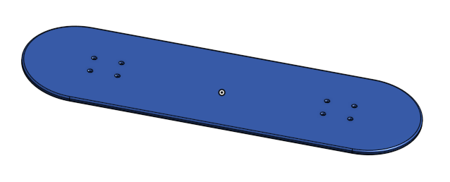
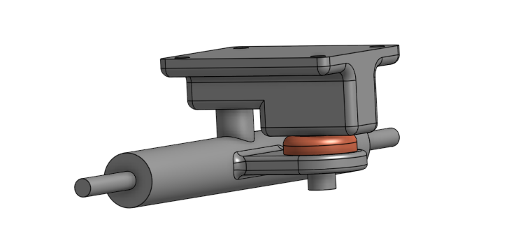
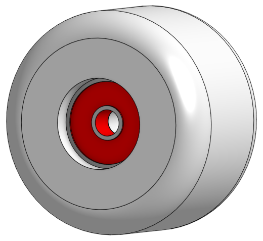
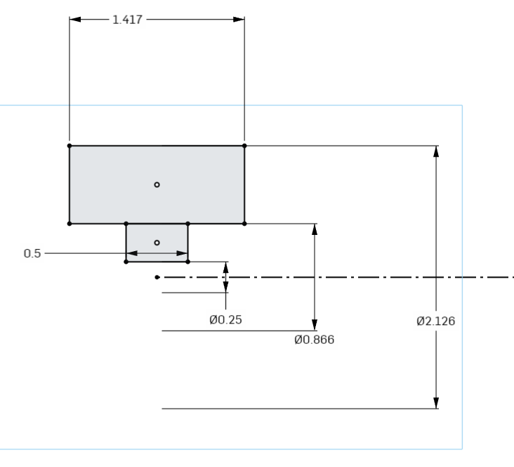
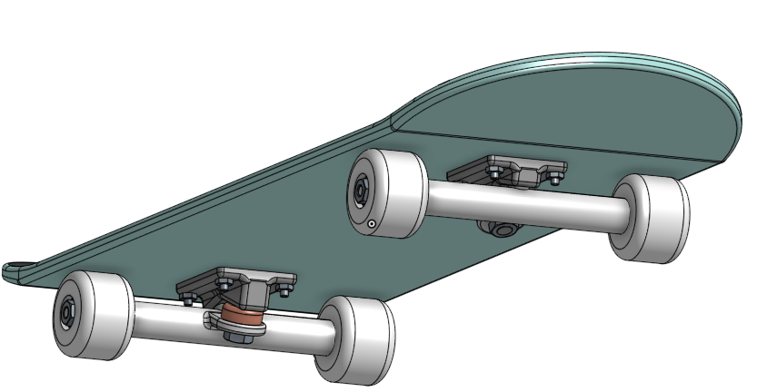
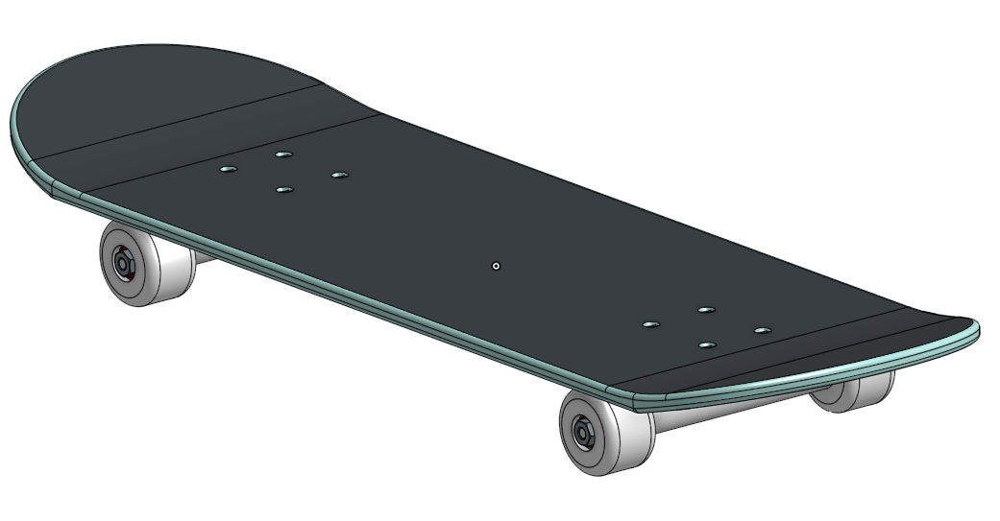
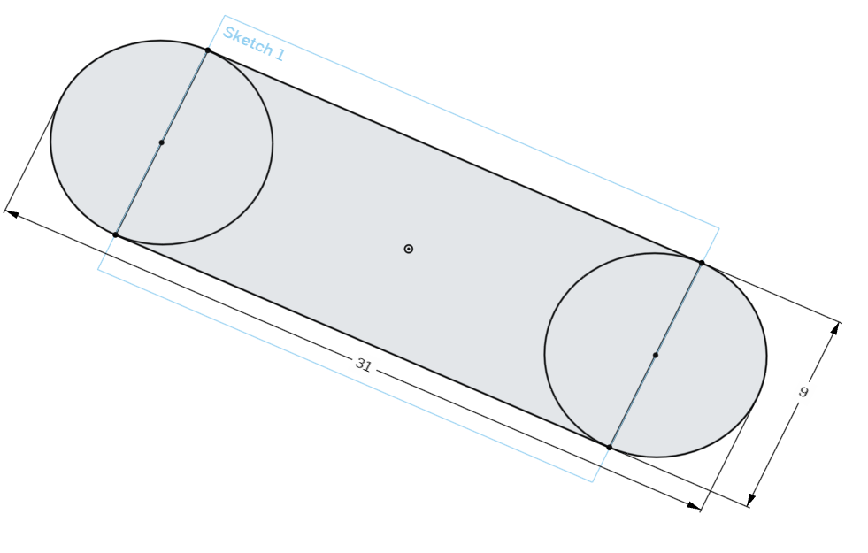
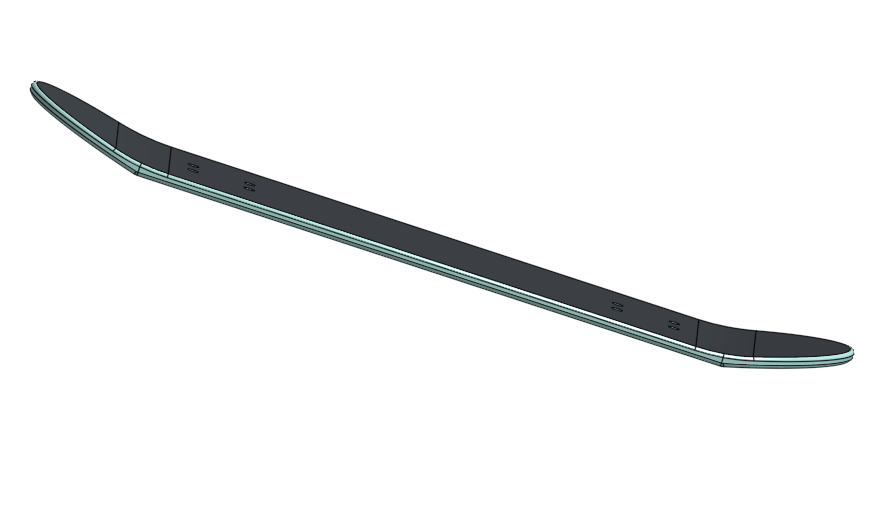
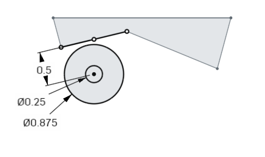
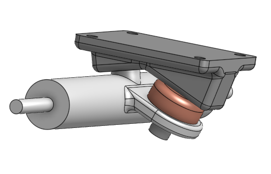

# AdvancedCAD

## Skateboard

For this assignment, I had to use Onshape to create a CAD skateboard. This project included multiple parts that had to then be assembled. After assembly, I went back and improved some of the parts to make them more realistic.

[Onshape Document](https://cvilleschools.onshape.com/documents/94688fa6ba9b8501a3c821bf/w/0247a133f9e5e94942ede10e/e/4af12767c85af2d5f4d7c289)

### Table of Contents
* [Deck](#Deck)
* [Trucks](#Trucks)
* [Wheels and Bearings](#Wheels_and_Bearings)
* [Assembly](#Assembly)
* [Bending the Board](#Bending_the_Board)
* [Realistic Trucks](#Realistic_Trucks)

### Deck

The deck was the simplest part of the board to complete. I had to make a rectangular sketch with a circle at each end, create a pattern for the holes, and extrude. I then added a fillet around the edge to give the board a smoother look.

### Trucks

For the trucks, I had to first sketch the baseplate. From there, I sketched the hanger and the bushing, as well as the tab that connects the two. I then extruded the geometry and added fillets.

### Wheels_and_Bearings

This part of the assignment was pretty straighforward. The most important part was to do a revolved extrusion instead of a normal one. This makes it much easier due to the circular shape of the object, and it makes it much easier to come back later and change the dimensions if necessary. The bearing could just be sketched within the wheel after it was extruded and the middle of the bearing could be set in by sketching a new circle and cutting away part of the bearing.

### Assembly

After creating all the necessary parts, I assembled them into the final product. This was fairly easy to do. All of the mate connectors that I needed were already there, so I just had to snap the pieces together. I also had to go in the Onshape standard parts libray and add in screws and nuts for the trucks and wheels. For this part, it is neccessary to make sure you use the exact right parts, otherwise they will not fit correctly.

### Bending_the_Board

For this part of the assignment, I didn't have to change the original sketch. I actually used the split tool to separate the semi circles at the end from the main rectangle. Then, I used the move tool to angle the ends up and I used fillets to smooth out the bend.

### Realistic_Trucks

For this final modification of my skateboard, I went back into the sketch for the truck and altered the shape of it to make it more realistic. In order to do this, I left the lines that other pieces were constrained to, and I redrew the rest of the lines at angles. Afterwards, I had to alter the position of the hanger and the thickness of the bushing to account for the different dimensions. One thing I had trouble with was trying to constrain the sketch for the tab coming off the hanger. In order to resconstrain it, I had to Use the circle on the end of the hanger on the tab sketch and then draw a midline to attach the sketch to. Normally, there would be a midpoint to use, but for some reason I could not find it.
