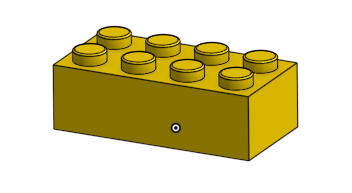
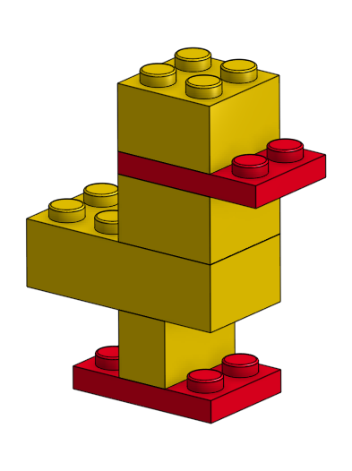

# AdvancedCAD

## Skateboard

For this assignment, I had to use Onshape to create a CAD skateboard. This project included multiple parts that had to then be assembled. After assembly, I went back and improved some of the parts to make them more realistic.

[Onshape Document](https://cvilleschools.onshape.com/documents/94688fa6ba9b8501a3c821bf/w/0247a133f9e5e94942ede10e/e/4af12767c85af2d5f4d7c289)

### Table of Contents
* [Deck](#Deck)
* [Trucks](#Trucks)
* [Wheels and Bearings](#Wheels_and_Bearings)
* [Assembly](#Assembly)
* [Bending the Board](#Bending_the_Board)
* [Realistic Trucks](#Realistic_Trucks)

### Deck

[Image Cred](https://github.com/afriedm49)

The deck was the simplest part of the board to complete. I had to make a rectangular sketch with a circle at each end and put tangent constraints at each end to keep the circles aligned. Next, I added a rectangle to use as a pattern for screw holes and I created another one by making it symmetrical across the center line. I used Onshape's hole tool to add holes at each corner of the two rectangles, which made it easy to add countersunk holes. I then added a fillet around the edge to give the board a smoother look. The most important parts that I learned here are first that it is easier to constrain than it is to dimension everything, and second that the hole tool is much easier to use than creating a sketch and removing it for each screw hole. 

### Trucks

[Image Cred](https://github.com/afriedm49)

For the truck, I first extruded part of the baseplate from the hole pattern rectangle that I already created. I then sketched the rest of the baseplate and hanger from the right plane. After extruding those parts, I created the bushing from a plane of the baseplate, and the connecting tab of the hanger from the surface of the bushing. The most important part of this step was learning how to use geometry from other sketches and objects. This allowed me to build on what I already had, rather than recreating each and every piece each time I needed to sketch something. 

### Wheels_and_Bearings

This part of the assignment was pretty straighforward. The most important part was to do a revolved extrusion instead of a normal one. This makes it much easier due to the circular shape of the object, and it makes it much easier to come back later and change the dimensions if necessary. The bearing could just be sketched within the wheel after it was extruded and the middle of the bearing could be set in by sketching a new circle and cutting away part of the bearing.

### Assembly

After creating all the necessary parts, I assembled them into the final product. This was fairly easy to do. All of the mate connectors that I needed were already there, so I just had to snap the pieces together. I also had to go in the Onshape standard parts libray and add in screws and nuts for the trucks and wheels. For this part, it is neccessary to make sure you use the exact right parts, otherwise they will not fit correctly.

### Bending_the_Board

For this part of the assignment, I didn't have to change the original sketch. I actually used the split tool to separate the semi circles at the end from the main rectangle. Then, I used the move tool to angle the ends up and I used fillets to smooth out the bend.

### Realistic_Trucks

For this final modification of my skateboard, I went back into the sketch for the truck and altered the shape of it to make it more realistic. In order to do this, I left the lines that other pieces were constrained to, and I redrew the rest of the lines at angles. Afterwards, I had to alter the position of the hanger and the thickness of the bushing to account for the different dimensions. One thing I had trouble with was trying to constrain the sketch for the tab coming off the hanger. In order to resconstrain it, I had to Use the circle on the end of the hanger on the tab sketch and then draw a midline to attach the sketch to. Normally, there would be a midpoint to use, but for some reason I could not find it.

## Legos

For this assignment, I had to first create a basic lego piece with many different configurations so that it could be changed into any lego brick and put into an assembly. Then, I had to use my configurations to assemble a lego duck.

### Bricks

[Onshape Document](https://cvilleschools.onshape.com/documents/5285c243cd846e4ce5aaaa91/w/66e07b668256a92d0052c5dd/e/8b098778b1494a0be095220d)

This assignment was relatively complex because of the sheer volume of configurations I had to make. Everything had to be done in a specific order, starting with the creation of the variables at the very beginning. Also, naming the part would have caused the entire thing to break due to a glitch with Onshape and the Part Name configuration tool. The best way to create a part with many different configurations is to keep the configuration names and tables very consistent and organized because it somewhat simplifies the process.

### Duck

[Onshape Document](https://cvilleschools.onshape.com/documents/5285c243cd846e4ce5aaaa91/w/66e07b668256a92d0052c5dd/e/92e33eea6e5c3d6c42ffcfa8)

This assignment was easy compared to the previous one because I was able to use Snap Mode to very quickly assemble many lego bricks. It definitely would have been much more difficult had I messed up something in the configurations in the previous assignment. Snap Mode made it almost as easy as building the duck with real legos because it automatically fits the pieces together and allows you to rotate them with the push of a button. The only problem I had with this was that one time Snap Mode aligned a connector with the wrong surface and caused a piece to be very slightly overlapping with another one. The best solution for this is to be very vigilant and make sure you are selecting the correct surfaces for the fastened mates.
